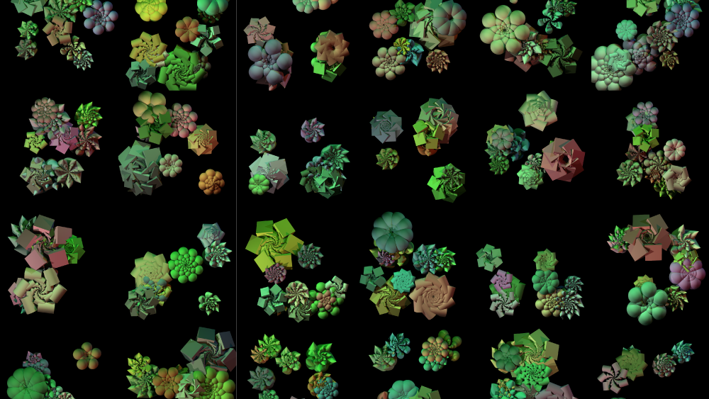
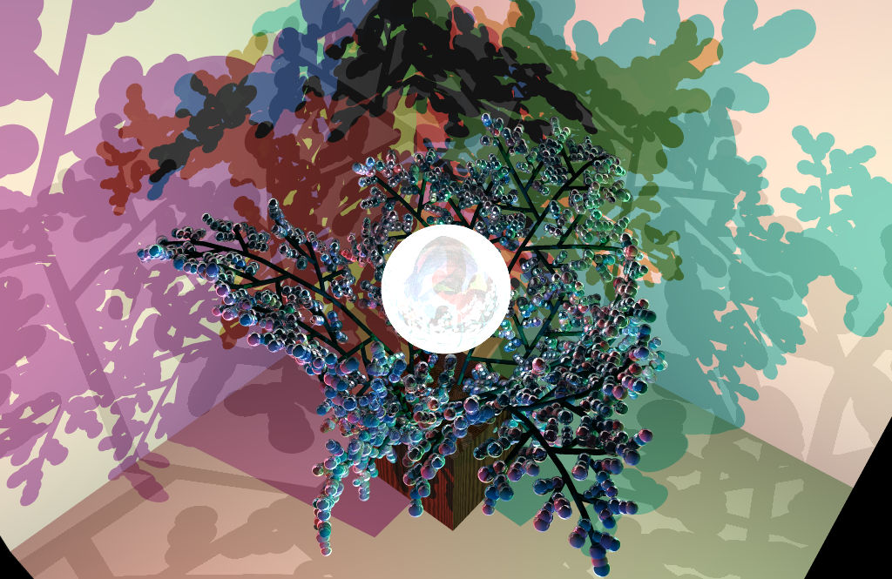

A few of my featured projects.

    
    

        The fascinating mathematic structures, the patterns derived from nature related to the renowned Fibonacci, and the spiral Phyllotaxis. The artwork was created using Netlogo3D with raytracing and x3d extensions. This piece is my Final Project for CSC150.
        
            
                <a class="button link" target="_blank"
                    href=" https://sites.google.com/augustana.edu/vietb/projects/maths-beauty">
                    read more &#x2192;</a>
            
            
                <a class="tag link" href="../coding/coding.html">#coding</a>
                <a class="tag link" href="./art.html">#art</a>
            
        
    

    
    

        Inspired by the foliage and the flora of the rain forest of the state of Washington. One of the
        centerpieces of the artwork is the fern feature. The ferns are the characteristic of the
        all-year-round rain. The rain always brings up the scent of the wooded forest. Every piece in the
        artwork reminds me of every hike through the wood.
        
            
                <a class="button link" target="_blank"
                    href=" https://sites.google.com/augustana.edu/vietb/projects/jewel-forest">read more &#x2192;</a>
            
            
                <a class="tag link" href="../coding/coding.html">#coding</a>
                <a class="tag link" href="./art.html">#art</a>
            
        
    

I will put more projects up here soon. It's just the matter of me coding the site out 😁
 

