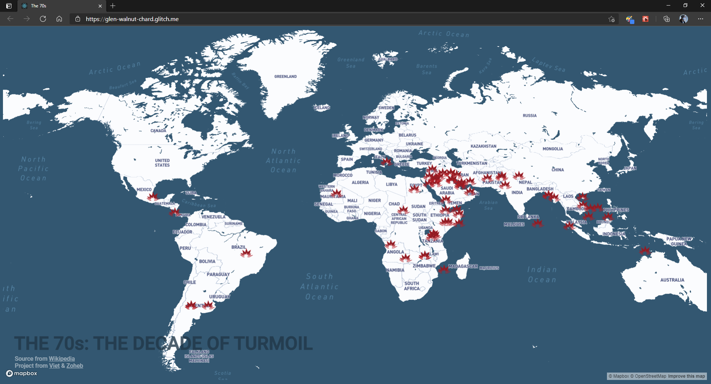
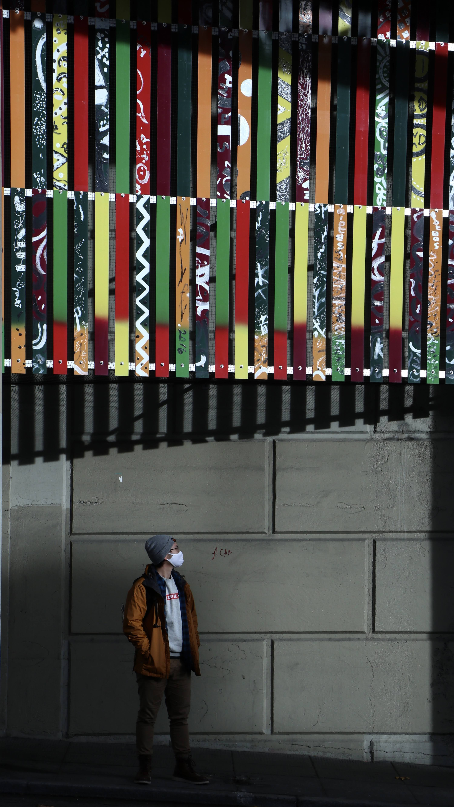
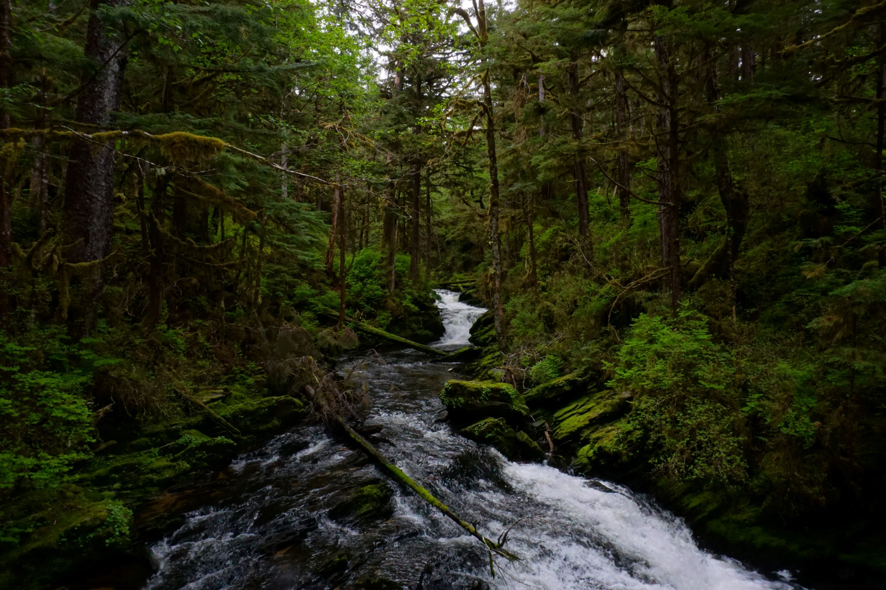

# CREATIVE CODER & STE<a class="link coloranimate hover-underline-animation" href="art.html">Art</a>M ADVOCATE

Việt Bùi, a creative artist & coder, a student, a naturalist, and a global citizen. Born and
raised in Ho Chi Minh City (HCMC), Vietnam. Grew up in an "engineer household", but Viet developed my
interest in
technology and drawing at an early age. Graphic artist for clubs, and non-profit
organizations in HCMC and the United States. Coder in a few hackathons, and coder by everyday.

Feel free to browse around for future / <a class="link hover-underline-animation"
        href="https://vietbuiminh.github.io/EDGE-Coding-Intern/lulac/">current</a> / <a
        class="link hover-underline-animation" href="http://webgeeksrus.com/test/her2o/">past</a> projects.
 
 

## CODING

        
        

                
A web app that let the user explore the war events that started in the 70s which
                snippet of information from the war with the interaction with geography through the map provided by
                MapBox.

                
                
                        <a class="button link" target="_blank"
                        href="https://devpost.com/software/the-70s-project">&#x2192;</a>
                
                        
                                <a class="tag link" href="coding.html">#coding</a>
                                <a class="tag link" target="_blank"
                                href="https://hackfromthepast.devpost.com/project-gallery">#winner</a>
                                <a class="tag link" target="_blank" href="https://hackfromthepast.devpost.com">#hackathon</a>
                                <a class="tag link">#MapBox</a>
                        
                
        

<a class="link hover-underline-animation" href="coding.html">more &#x2192;</a>

## ART



 
Feeling adventurous? I enjoy going around the country to different national parks. Best overall are Mt.Rainier and Tongass.

        
        
        
        

                
        

 
