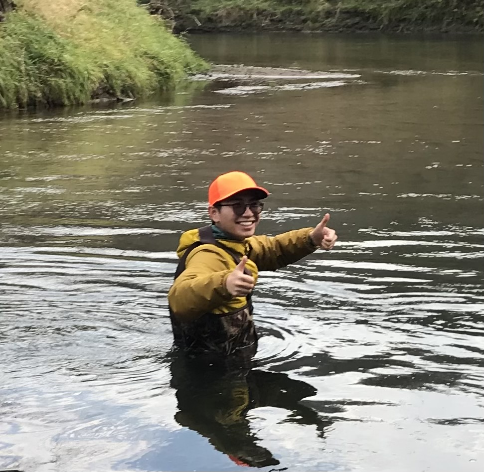

<h1 style="text-transform:lowercase;">hello there!</h1>

Welcome to my tiny web corner!

If you have not known me, here are a few gists that you might find interesting.
Born in Ho Chi Minh City, Vietnam,
I have been to various places with different stages of my education from Oregon to Washington, Illinois to Minnesota. 
Currently, I am a researcher in Dr. Jorge Lorenzo-Trueba's Coastal Dynamic Lab at University of Florida.
I am also an engineer, a computer scientist, and someone who would go ahead and hug tree when I see one. 

    
    <a class="tag link" href="{{ "tags/" | append: tag[0] | relative_url }}">#{{ tag[0] }}</a>
    

  

        
        
        
        

                
        

 
